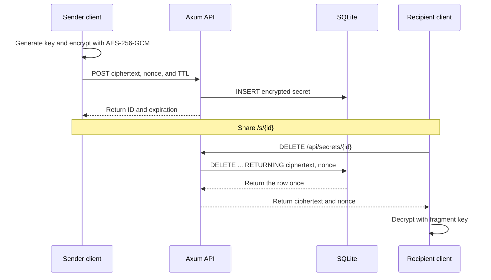

# Ignite — Burn After Reading

[](https://github.com/coltonhyer/Ignite/actions/workflows/main.yml)
[](LICENSE)

A server-blind secret-sharing application where encrypted messages are destroyed by the database during their first successful read.

## Why this project is interesting

- **The server cannot decrypt secrets.** AES-256-GCM encryption, decryption, and key handling stay in the client.
- **Single-use is a database guarantee.** One `DELETE ... RETURNING` statement reads and destroys a secret atomically, including under concurrent requests.
- **Keys never enter an HTTP request.** Share links carry the decryption key in the URL fragment (`#`), which browsers do not send to servers.
- **Link previews cannot burn secrets.** Retrieval uses an explicit `DELETE` API call; there is no `GET` endpoint for secret data.
- **The client is cross-platform Rust.** The Dioxus application targets browser WebAssembly and native desktop.

## How it works



The core operation lives in [`SecretStore::burn_secret`](backend/src/store.rs):

```sql
DELETE FROM secrets
WHERE id = ?1 AND datetime(expires_at) > datetime('now')
RETURNING ciphertext, nonce
```

There is no preceding `SELECT` and no application-level lock. SQLite decides which concurrent request receives the row; subsequent accepted burns receive `410 Gone`.

## Security model

| Boundary | Guarantee |
|---|---|
| Client | Holds plaintext and the AES-256-GCM key |
| URL | Carries the key only after `#` |
| API | Receives ciphertext, nonce, metadata, and secret ID |
| Database | Stores ciphertext and nonce until burn or expiration |
| Logs | Contain operational metadata, never payloads or keys |

Secret lookup responses deliberately avoid existence disclosure:

- `400 Bad Request` for malformed input.
- `410 Gone` for missing, expired, or previously burned secrets.
- `404 Not Found` is never used for secret lookups.

Ignite is a portfolio project and has not received an external security audit.

## Technology

| Area | Stack |
|---|---|
| Backend | Rust, Axum, Tokio, SQLx |
| Storage | SQLite in WAL mode |
| Frontend | Rust, Dioxus 0.7, WebAssembly/desktop |
| Cryptography | Web Crypto API in browsers; `aes-gcm` on desktop |
| Abuse prevention | Per-route IP rate limiting with `tower_governor` |
| Delivery | GitHub Actions; Cloudflare Workers static assets |

## Repository map

```text
backend/                  Axum API, SQLite store, migrations, and integration tests
frontend/                 Dioxus web/desktop client and client-side cryptography
shared/                   Request/response types and validation limits
evolution/foundations/    Architecture and security source of truth
evolution/decisions/      Architecture decision records
```

## Run locally

### Prerequisites

- A stable [Rust toolchain](https://rustup.rs/).
- The WebAssembly target and Dioxus CLI for browser development:

```bash
rustup target add wasm32-unknown-unknown
cargo install dioxus-cli --version 0.7.3
```

Native Linux builds also require the [Dioxus desktop system dependencies](https://dioxuslabs.com/learn/0.7/getting_started/#linux).

### Browser client

Start the API from the repository root:

```bash
cargo run -p ignite
```

In another terminal, start the Dioxus development server:

```bash
cd frontend
dx serve --web
```

Open `http://localhost:8080`. The development server proxies `/api` requests to `http://localhost:3000`.

### Desktop client

With the API running, launch the native client from the repository root:

```bash
cargo run -p frontend
```

### Configuration

| Environment variable | Default | Description |
|---|---|---|
| `PORT` | `3000` | API listen port |
| `DATABASE_URL` | `./ignite.db` | SQLite database path |

## Verification

The main CI workflow runs:

```bash
cargo check --all-targets
cargo check -p frontend --target wasm32-unknown-unknown
cargo clippy --all-targets -- -D warnings
cargo fmt --all -- --check
cargo test --all-targets
```

Tests worth reading:

- [`backend/tests/atomicity.rs`](backend/tests/atomicity.rs) exercises API semantics, rate limits, and concurrent destructive reads.
- [`frontend/src/crypto.rs`](frontend/src/crypto.rs) covers encryption round trips and tamper/wrong-key failures.
- [`backend/src/handlers/create.rs`](backend/src/handlers/create.rs) covers payload, TTL, encoding, and malformed-request validation.

## API summary

| Method | Route | Purpose | Rate limit |
|---|---|---|---|
| `POST` | `/api/secrets` | Store an encrypted secret | 10 requests/minute/IP |
| `DELETE` | `/api/secrets/{id}` | Atomically retrieve and destroy | 30 requests/minute/IP |
| `GET` | `/health` | Check API and database health | — |

`POST /api/secrets` accepts:

```json
{
  "ciphertext": "<base64url-encoded>",
  "nonce": "<base64url-encoded>",
  "ttl_seconds": 3600
}
```

Ciphertext is limited to 10 KiB after decoding. TTL must be between 300 seconds and 86,400 seconds; the default is 3,600 seconds.

## Agent-assisted engineering

Ignite was built as an experiment in two agent-assisted workflows: narrowly delegated backend tasks and hands-on pair programming for the frontend. The useful lesson was not that agents remove the need for review; it was that explicit invariants, small scopes, executable checks, and close feedback make their speed safe to use.

That lesson is captured in [`AGENTS.md`](AGENTS.md), the [`evolution/foundations/`](evolution/foundations/) documents, and CI checks that protect the security boundary.

## Contributing and security

Read [`CONTRIBUTING.md`](CONTRIBUTING.md) before making changes. Report vulnerabilities privately according to [`SECURITY.md`](SECURITY.md).

Licensed under the [MIT License](LICENSE).
